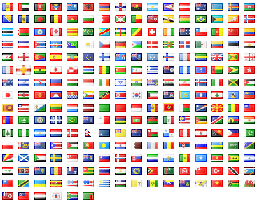
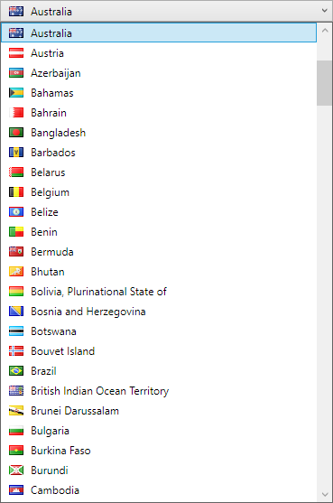

[](https://www.nuget.org/packages/FamFamFam.Flags.Wpf/)

# FamFamFam flag icons for WPF

A simple library for showing flags in WPF.



## Installation

Source from [NuGet](https://www.nuget.org/packages/FamFamFam.Flags.Wpf/):

> Install-Package FamFamFam.Flags.Wpf

## Usage

The following code creates an image of flag that corresonds to the [two letter ISO 3166-1 alpha-2 country
code](https://en.wikipedia.org/wiki/ISO_3166-1_alpha-2) that is resolved by the binding expression.
Note that you may have to include a path in your binding, depending upon the structure of your `DataContext`.

```xaml
<Image Source="{Binding Converter={StaticResource CountryIdToFlagImageSourceConverter}}"
       RenderOptions.BitmapScalingMode="HighQuality" />
```

The converter in this binding transforms the country code into an `ImageSource`.
This requires an instance of the converter class to be within scope as a resource.

You might use code such as this somewhere up the logical tree:

```xaml
<Flags:CountryIdToFlagImageSourceConverter x:Key="CountryIdToFlagImageSourceConverter" />
```

You will also have to declare the `Flags` XML namespace by including this code as an attribute on any ancestor node of the above declaration.

```xaml
xmlns:Flags="clr-namespace:FamFamFam.Flags.Wpf;assembly=FamFamFam.Flags.Wpf"
```

If images appear blurry, set `UseLayoutRounding` to `true` on a parent element, and be sure to use
`RenderOptions.BitmapScalingMode="HighQuality"` on the `<Image>` itself.

You could show a `ComboBox` of country flags and names using the following code:

```xaml
<ComboBox ItemsSource="{Binding Source={x:Static flags:CountryData.AllCountries}}">
  <ComboBox.ItemTemplate>
    <DataTemplate DataType="flags:CountryData">
      <StackPanel Orientation="Horizontal">
        <Image Source="{Binding Path=Iso2, Converter={StaticResource CountryIdToFlagImageSourceConverter}}"
               Stretch="None" Width="23" Height="18" RenderOptions.BitmapScalingMode="HighQuality" />
        <TextBlock Text="{Binding Path=Name}" Margin="5,0,0,0" VerticalAlignment="Center" />
      </StackPanel>
    </DataTemplate>
  </ComboBox.ItemTemplate>
</ComboBox>
```

The result would resemble:



## Coverage

As noted in `CountryData.cs`:

* FamFamFam Flags includes images for non-ISO 3166-1 entities
  * `an`
  * `catalonia`
  * `cs`
  * `en`
  * `eu`
  * `scotland`
  * `wales`
* FamFamFam Flags doesn't cover ISO 3166-1 entities:
  * `aq` (Antarctica)
  * `bq` (Bonaire, Sint Eustatius and Saba)
  * `cw` (Curaçao)
  * `im` (Isle of Man)
  * `je` (Jersey)
  * `bl` (Saint Barthélemy)
  * `mf` (Saint Martin (French part))
  * `sx` (Sint Maarten (Dutch part))
  * `ss` (South Sudan)

## Credits

The flag icons were created by Mark James as the [famfamfam flag icon set](http://www.famfamfam.com/lab/icons/flags/),
and are available for free use for any purpose with no requirement for attribution.

This library was created by Drew Noakes in 2009 and was hosted [here](https://www.drewnoakes.com/code/wpf/flags/)
until moved to [GitHub](https://github.com/drewnoakes/famfamfam-flags-wpf) and NuGet in 2017.
